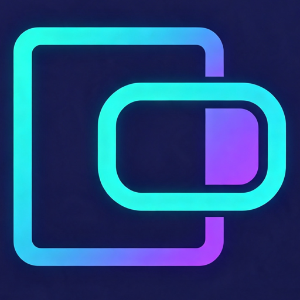

<p align="center">
  
</p>

# uvcpad

**Turn your Android tablet into a transparent touch display for your PC.**

uvcpad merges two battle-tested projects into a single app: a USB UVC capture card mirrors your PC screen onto the tablet (from hdmi2mp), while a transparent touch layer translates finger gestures into **Bluetooth HID mouse reports** that control the PC cursor (from KeysJoy).

See and touch on the same screen — the video shows through, and the touch layer never blocks the view. **Touch only. No keyboard. No drivers.**

> Current version v0.2.10 (2026-08-13). M1 skeleton integration and the M2 interaction entry (drop triangle + auto-hiding key bar) are complete; on-device verification is in progress.

## Features

- **UVC video display**: MS2130 HDMI→USB capture card, plug-and-play; OpenGL-rendered fullscreen view of the PC screen
- **Bluetooth HID touchpad**: the tablet registers as a mouse HID device — no driver needed on the PC
- **Transparent touch layer**: receives events only, draws nothing, zero visual occlusion; the touch area exactly matches the display area (letterbox edges are ignored)
- **Full gesture set**: single-finger move, tap to click, two-finger right-click, long-press / double-tap drag, two-finger scroll
- **Touchpad only, no keyboard**: only the mouse report is registered, no keyboard capability at all
- **5 sensitivity levels**: switch in one tap from the key bar
- **Auto-pair / auto-reconnect**: remembers the last device and reconnects automatically
- **Resolution switching**: 16:9 (1920×1080) ↔ 4:3 (1872×1404), remembers your choice; falls back to the nearest supported resolution when the capture card cannot handle the selected one
- **One-tap screenshot**: saved to the system gallery
- **E-ink friendly**: 4:3 by default, tuned for e-ink tablets such as the Huawei MatePad Paper

## Architecture

```
┌───────────────────── pad (Android) ─────────────────────┐
│                                                          │
│  ┌─ Display path ────────────────────────────────────┐   │
│  │ PC HDMI → MS2130 capture card → USB → AUSBC(UVC)  │   │
│  │ → OpenGL render → fullscreen display (bottom)     │   │
│  └────────────────────────────────────────────────────┘   │
│                          ▲ transparent overlay            │
│  ┌─ Touch path ──────────────────────────────────────┐   │
│  │ touch gestures → gesture engine (transparent layer)│   │
│  │ → ScrollableTrackpadMouseReport (ID=4, 7 bytes)   │   │
│  │ → BluetoothHidDevice → PC cursor move/click/scroll │   │
│  └────────────────────────────────────────────────────┘   │
│                                                          │
└──────────────────────────────────────────────────────────┘
```

The two paths run independently in parallel: the display path depends only on USB, the touch path only on Bluetooth — no resource contention.

- **Display path**: AUSBC 3.6.0 captures UVC frames; `AspectRatioTextureView` + OpenGL renders them (reused from hdmi2mp)
- **Touch path**: `ViewListener` gesture engine → relative-motion mapping → HID report sender (reused from KeysJoy, mouse capability only)
- **Integration layer**: `TransparentTouchLayer` overlays the video fullscreen; the top drop triangle (event-exempt area) opens the auto-hiding key bar

| Layer | Key classes | Responsibility |
|---|---|---|
| UI | `DropTriangleView`, `KeyBarPanel`, `KeyBarController` | drop triangle, key bar, 4s auto-hide |
| Touch | `TransparentTouchLayer`, `ViewListener`, `RelativeMouseSender` | gestures → relative motion → HID reports |
| Display | `AspectRatioTextureView` (AUSBC) | UVC capture + OpenGL rendering |
| Base | `BluetoothController`, `DescriptorCollection`, `SpeedLevel` | HID registration/reconnect/multi-device, mouse descriptor, 5 speed levels |

Stack: Kotlin · AUSBC 3.6.0 · BluetoothHidDevice (API 28+) · OpenGL · minSdk 28 / targetSdk 36.

## Quick Start

### Build

Option A — Android Studio

1. Open the `android/` directory in Android Studio
2. Wait for the Gradle sync (Gradle 9.3.1; CN mirrors are preconfigured)
3. Press Run ▶

Option B — command line

```bash
cd android
./gradlew assembleDebug
# APK output: android/app/build/outputs/apk/debug/app-debug.apk
```

### Install

```bash
adb install android/app/build/outputs/apk/debug/app-debug.apk
```

Or copy the APK to the tablet and install it directly. On first launch, grant the camera and Bluetooth permissions when prompted.

## Usage

### 1. Connect the capture card

1. Plug the MS2130 capture card into the tablet via USB-C (OTG)
2. Grant USB access and allow the camera permission
3. The picture appears. If the capture card does not support the selected resolution, the app falls back to the nearest supported one and notifies you

### 2. Pair over Bluetooth (on the PC)

1. In the PC's Bluetooth settings, search for the device **`uvcpad`** (the HID name the app registers)
2. Pair — **no driver installation required**
3. Once connected, the tablet's transparent touchpad starts working

### 3. Gestures

| Gesture | Effect |
|---|---|
| Single-finger move | Move the cursor |
| Tap | Left click |
| Two-finger tap / two-finger lift | Right click |
| Long-press and drag | Left-button drag |
| Double-tap then drag | Left-button drag |
| Two-finger scroll | Scroll |

### 4. Key bar

The drop triangle at the top center is the only persistent UI. Tap it to open the key bar, which **auto-hides after 4 seconds** (configurable). Tapping the triangle never triggers a stray left click.

| Button | Action |
|---|---|
| Speed | Cycle through 5 sensitivity levels |
| Bluetooth | Connect / disconnect, switch devices (remembers the last device) |
| Auto-pair | Toggle auto-reconnect |
| Resolution | Switch 16:9 ↔ 4:3 (remembers your choice) |
| Screenshot | Save to the system gallery |
| Exit | Clean up and quit |

> The key bar contains no keyboard settings — uvcpad is a touchpad only.

## Project Structure

```
uvcpad/
├── readme.md / readme_cn.md        # This documentation (English / Chinese)
├── docs/
│   ├── PROPOSAL.md                 # Requirements (frozen)
│   ├── DESIGN.md                   # Technical design
│   ├── todo.md                     # To-do list
│   ├── journey.md                  # Development log
│   └── assets/icon.png             # App icon
└── android/                        # Android project
    └── app/src/main/
        ├── AndroidManifest.xml
        ├── java/com/github/ifeel/uvcpad/
        │   ├── MainActivity.kt     # lifecycle / wiring / permissions
        │   ├── touch/              # transparent touch layer
        │   ├── ui/                 # drop triangle + key bar
        │   ├── bt/                 # Bluetooth HID (incl. reports/senders/listeners)
        │   └── UvcpadPrefs.kt      # preferences
        └── res/                    # layouts / resources / device filter / third-party licenses
```

## Credits & License

- Display path integrated from [hdmi2mp](https://github.com/iFeel-is-a-mouse/) (MS2130/UVC capture & display)
- Touch path integrated from [KeysJoy](https://github.com/iFeel-is-a-mouse/KeysJoy) (Bluetooth HID touchpad)
- UVC capture based on [AndroidUSBCamera (AUSBC) 3.6.0](https://github.com/ernestp/AndroidUSBCamera)

License texts for libuvc, libusb and libjpeg-turbo ship inside the APK (`app/src/main/res/raw/`).
